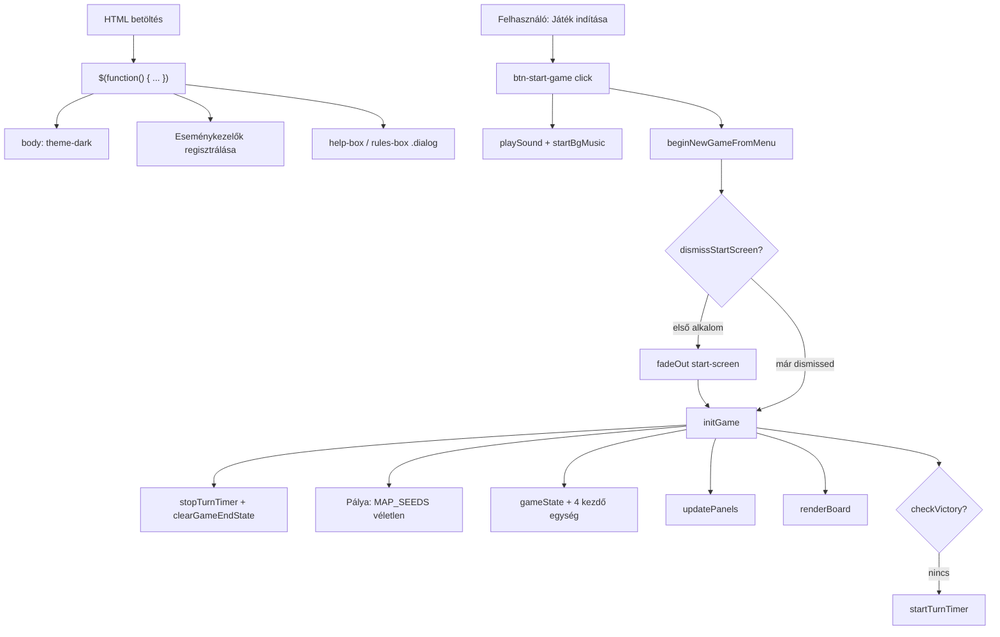
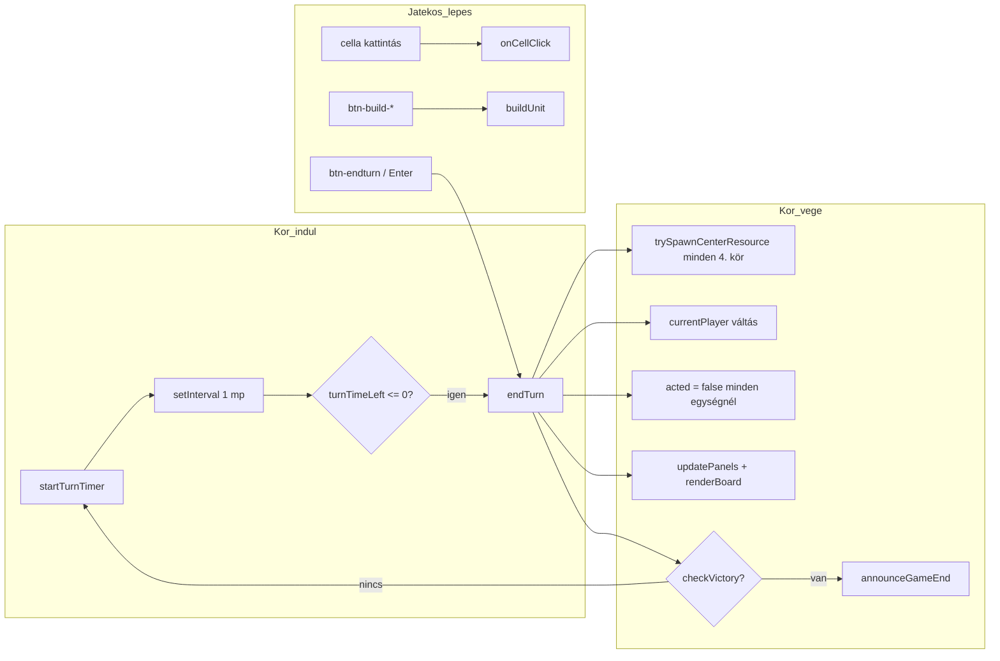
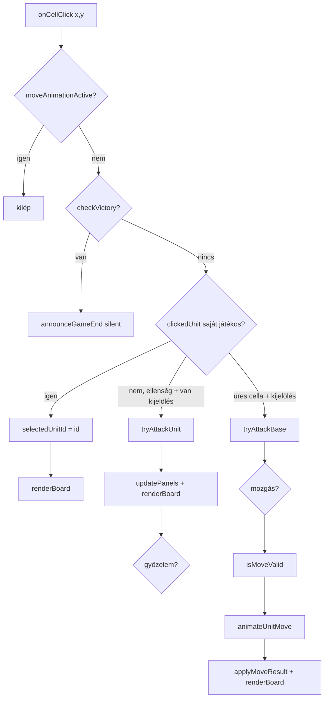
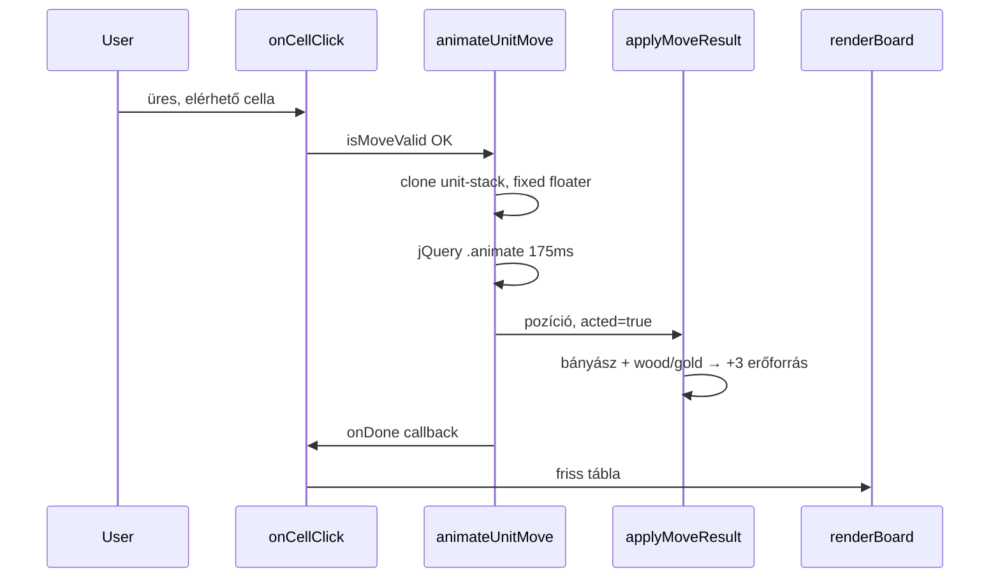

# Islandors — játékfolyamat és hívási lánc

Ez a dokumentum a `main.js` függvényei alapján írja le, hogyan működik a játék, és vizuálisan mutatja a fő hívási láncokat. A cél: átláthatóvá tenni a sok függvényt és a jQuery-s részeket.

---

## 1. Rövid összefoglaló

**Islandors** egy kétjátékos, körökre osztott stratégiai játék 6×6-os pályán.

| Fogalom | Jelentés |
|---------|----------|
| **Piros** | bal felső sarok (0,0), kezd |
| **Kék** | jobb alsó sarok (5,5) |
| **Kör** | egy játékos ideje; minden egység egyszer léphet (`acted`) |
| **Győzelem** | ellenfél bázis HP = 0 **vagy** ellenfélnek nincs egysége |

**Fő ciklus:** menü → `initGame()` → játék (kattintás / építés / kör vége) → `renderBoard()` + `updatePanels()` → győzelem esetén `announceGameEnd()`.

---

## 2. Globális állapot

```text
gameState = {
  currentPlayer: "red" | "blue",
  theme: "dark" | "light",
  red:  { wood, gold, baseHp },
  blue: { wood, gold, baseHp },
  terrain: [6][6],   // "empty" | "wood" | "gold" | "base_red" | "base_blue"
  units: [ { id, type, player, x, y, hp, acted }, ... ],
  turnNumber,
  turnSeconds,
  turnTimeLeft,
  mapSeedName
}
```

**Egyéb globális változók:**

| Változó | Szerep |
|---------|--------|
| `selectedUnitId` | kiválasztott egység |
| `nextUnitId` | új egység ID generálás |
| `moveAnimationActive` | mozgás animáció alatt nem lehet kattintani |
| `gameSessionActive` | játék fut (Enter = kör vége) |
| `startScreenDismissed` | menü már eltűnt |
| `gameEndAnnounced` | győzelmi `alert` már megjelent |
| `turnTimerHandle` | `setInterval` azonosító |

---

## 3. Indulás — teljes hívási lánc



**`initGame()` lépései:**

1. Timer leállítása, győzelem UI törlése (`clearGameEndState`).
2. 6×6 `terrain` tömb: minden `empty`, (0,0) = `base_red`, (5,5) = `base_blue`.
3. Véletlen `MAP_SEEDS` pálya → erőforrás mezők (`wood` / `gold`).
4. `gameState` feltöltése (piros kezd, 2 fa / 1 arany mindkét oldalon, bázis HP = 8).
5. Kezdő egységek: piros bányász + katona, kék bányász + katona.
6. `updatePanels()` → `renderBoard()` → `startTurnTimer()` (ha nincs azonnali győzelem).

---

## 4. Egy kör életciklusa



**`endTurn()` részletei:**

- Ha már van győztes → kilép.
- `stopTurnTimer()`, kijelölés törlése.
- `turnNumber++`; ha `turnNumber % 4 === 0` → `trySpawnCenterResource()` (véletlen fa/arany a közép környékén).
- `currentPlayer` = `otherPlayer(...)`.
- Minden egység `acted = false`.
- UI frissítés, győzelem ellenőrzés, új timer.

---

## 5. Cella kattintás — döntési fa

Ez a játék **legfontosabb** interakciós útja.



**Prioritás sorrend** (`onCellClick`):

1. Animáció fut → semmi.
2. Játék vége → csendes győzelmi UI.
3. **Saját egységre katt** → kiválasztás (`selected`), zöld `move-hint` / piros `attack-hint` a `renderBoard`-ban.
4. **Ellenség egységre** (kijelöléssel) → `tryAttackUnit`.
5. **Üres cella** → először `tryAttackBase` (szomszédos ellenség bázis), ha nem → `animateUnitMove`.

---

## 6. Mozgás és gyűjtés



| Függvény | Feladat |
|----------|---------|
| `getReachableCells(unit)` | BFS, Manhattan, max `moveRange` (1 vagy 2) |
| `canWalkOnto(x,y,player)` | nincs egység; saját bázis OK; **ellenség bázisra nem** léphet |
| `isMoveValid` | cél benne van a reachable listában és nem `acted` |
| `applyMoveResult` | koordináta, `acted`, bányász gyűjt (+3), hang |
| `animateUnitMove` | vizuális csúszás jQuery-vel (lásd 8. fejezet) |

---

## 7. Harc és győzelem

### Támadás

| Cél | Függvény | Feltételek |
|-----|----------|------------|
| Egység | `tryAttackUnit` | `canAttack`, szomszéd, nem saját, nem `acted` |
| Bázis | `tryAttackBase` | ugyanaz + `isEnemyBaseCell` |

Sebzés: `getAttackDamage` → `UNIT_DATA[type].damage`. Egység HP ≤ 0 → törlés a `gameState.units` tömbből.

### Győzelem

```text
getVictoryInfo()
  → red.baseHp <= 0  → blue nyert (reason: base)
  → blue.baseHp <= 0 → red nyert
  → countUnits(red) === 0  → blue nyert (reason: units)
  → countUnits(blue) === 0 → red nyert
  → null (folytatódik)

checkVictory() → winner string vagy null

announceGameEnd(winner)
  → stopTurnTimer, body.game-over, panelek winner/defeated class
  → status szöveg, updatePanels, renderBoard, alert (ha nem silent)
```

**Hol hívják a győzelmet:** `onCellClick` (támadás/mozgás után), `endTurn`, `initGame`, `loadGame`, `buildUnit` elején (blokkol).

---

## 8. jQuery és jQuery UI — mit csinálnak?

A jQuery itt **nem** a játéklogikát tartja, hanem a DOM-ot köti össze az eseményekkel és animációkkal. A szabályok a sima JavaScript függvényekben vannak.

### 8.1 Indulás: `$(function () { ... })`

Ez a **document ready** callback: amikor a HTML kész, lefut egyszer.

| Sor / blokk | jQuery művelet | Cél |
|-------------|----------------|-----|
| `$("body").addClass("theme-dark")` | class | alap téma |
| `$("#board").on("click", ".cell", ...)` | delegált esemény | cella katt → `onCellClick` (a tábla minden render után újraépül, de a handler a `#board`-on marad) |
| `$("#btn-*").click(...)` | gomb események | menü, mentés, építés, kör vége, stb. |
| `$("#help-box").dialog({...})` | **jQuery UI** | modális súgó ablak |
| `$("#rules-box").dialog({...})` | **jQuery UI** | modális szabály ablak |
| `$(document).keydown` | Enter → `endTurn` | gyors kör vége |
| `$(document).mousemove` | `#timer-line` opacity | vizuális visszajelzés |

### 8.2 DOM frissítés — szöveg és class

| Függvény | jQuery hívások |
|----------|----------------|
| `updatePanels()` | `$("#res-red-wood").html(...)`, hasonlóan gold/HP; `$("#turn-red").html("Te jössz!")`; `.toggleClass("info-panel-active")` |
| `renderBoard()` | `$("#board").empty()`; cellák: `$('<div class="...">')` + `.appendTo($b)`; kijelölés: `.addClass("selected" \| "move-hint" \| "attack-hint")` |
| `startTurnTimer()` | `$("#timer-val").html(...)`, `.css("color")`, `#timer-line` class |
| `announceGameEnd()` | `$("body").addClass("game-over")`, panelek `info-panel-defeated` / `winner` |
| `clearGameEndState()` | class-ok törlése |
| `toggleTheme()` | `body` theme-light / theme-dark váltás |
| `loadGame()` | téma class a mentésből |

**`$cellAt(x, y)`** — segéd:

```javascript
return $("#board .cell").eq(cellIndex(x, y));
```

A cellák sorrendje: balról jobbra, fentről le (y, majd x), ezért `cellIndex = y * BOARD_SIZE + x`.

### 8.3 Animációk

**Mozgás — `animateUnitMove`:**

1. `$fromCell.find(".unit-stack")` — a cellában lévő egység HTML.
2. Eredeti stack `visibility: hidden`.
3. **Klón** egy `position: fixed` `#floater` div-be (`$('<div class="unit-move-floater">')`).
4. `$floater.animate({ left, top }, 175ms, "swing", callback)` — képernyő koordináták `offset()` + scroll korrekció.
5. Callback: floater törlése, `applyMoveResult`, `moveAnimationActive = false`.

**Támadás visszajelzés — `pulseUnitCell`:**

```javascript
$stack.stop(true, true).animate({ opacity: 0.55 }, 70).animate({ opacity: 1 }, 70);
```

### 8.4 Menü — `showStartScreen` / `dismissStartScreen`

| Lépés | jQuery |
|-------|--------|
| Menü megjelenítés | `$screen.removeClass("hidden").css("display","flex").hide().fadeIn(160)` |
| Menü eltűnés | `fadeOut` helyett class + `setTimeout` 280ms → `display: none` |
| Body állapot | `body.at-menu` class (CSS rejti a játékot) |

### 8.5 jQuery UI `.dialog()`

- `$("#help-box").dialog({ autoOpen: false, width: 660, modal: true, ... })`
- `$("#btn-help").click` → `$("#help-box").dialog("open")`

A **modal: true** háttér overlay; a tartalom az `index.html`-ben rejtett `div`-ekben van.

### 8.6 Mi **nem** jQuery?

- Pálya, egységek, harc, győzelem, BFS mozgás → tiszta JS + `gameState`.
- Mentés → `localStorage` + `JSON.stringify` (nincs AJAX).

---

## 9. Függvények csoportosítva

### Segéd / koordináta

`cellIndex`, `cellKey`, `inBounds`, `manhattan`, `isAdjacent`, `$cellAt`

### Játékos / bázis

`getBasePos`, `getEnemyBasePos`, `getPlayerData`, `otherPlayer`, `playerLabel`, `isEnemyBaseCell`, `isOwnBaseCell`, `clampBaseHpValue`, `normalizeBaseHp`

### Egység

`getUnitInfo`, `getUnitById`, `getSelectedUnit`, `getUnitAt`, `makeUnit`, `countUnits`, `getMoveRange`, `getAttackDamage`

### Pálya / mozgás

`canWalkOnto`, `getReachableCells`, `isMoveValid`, `applyMoveResult`, `animateUnitMove`, `findSpawnCell`

### Harc

`tryAttackUnit`, `tryAttackBase`, `playAttackSound`, `pulseUnitCell`

### Kör / idő

`startTurnTimer`, `stopTurnTimer`, `endTurn`, `trySpawnCenterResource`, `getTurnSecFromConfig`

### Győzelem / UI szöveg

`getVictoryInfo`, `checkVictory`, `announceGameEnd`, `clearGameEndState`, `gameEndStatusText`, `gameEndAlertText`, `victoryStatusText`

### Kirajzolás

`renderBoard`, `updatePanels`, `terrainClass`, `terrainBlockHtml`, `onCellClick`

### Játék életciklus

`initGame`, `buildUnit`, `saveGame`, `loadGame`, `showStartScreen`, `dismissStartScreen`, `beginNewGameFromMenu`, `beginLoadFromMenu`

### Hang / téma

`playSound`, `getBgMusic`, `startBgMusic`, `stopBgMusic`, `toggleTheme`

---

## 10. Építés (gyártás) hívási lánc

```text
#btn-build-miner|soldier|scout click
  → buildUnit(type)
      → checkVictory (kilép ha vége)
      → elég wood/gold? (alert)
      → findSpawnCell (bázis szomszéd, üres, nem ellenség bázis)
      → költség levonás, gameState.units.push(makeUnit(...))
      → playSound("spawn")
      → updatePanels() + renderBoard()
```

---

## 11. Mentés / betöltés

```text
saveGame()
  → localStorage "islandorsSave" = { gs, selectedUnitId, nextUnitId }

loadGame() / beginLoadFromMenu()
  → JSON parse, terrain 6×6 ellenőrzés
  → gameState visszaállítás, téma class, clearGameEndState
  → updatePanels + renderBoard
  → startTurnTimer VAGY announceGameEnd(silent)
```

---

## 12. Egységtípusok (UNIT_DATA)

| Típus | Lépés | Sebzés | Költség | Speciális |
|-------|-------|--------|---------|-----------|
| `miner` | 1 | 0 | 2 fa, 1 arany | gyűjt fa/arany mezőn (+3) |
| `soldier` | 1 | 3 | 2 fa, 2 arany | támad |
| `scout` | 2 | 1 | 1 fa, 2 arany | támad, kard helyett „magic” hang |

---

## 13. Gyors referencia — „ha ezt csinálom, mi fut?”

| Felhasználói akció | Fő függvény-lánc |
|--------------------|------------------|
| Oldal betöltése | `$(ready)` → események, dialog init |
| Játék indítása (menü) | `beginNewGameFromMenu` → `dismissStartScreen` → `initGame` → `startTurnTimer` |
| Saját egységre katt | `onCellClick` → `selectedUnitId` → `renderBoard` (hint-ek) |
| Üres cellára lépés | `onCellClick` → `animateUnitMove` → `applyMoveResult` → `renderBoard` |
| Ellenségre katt | `tryAttackUnit` → `checkVictory` → esetleg `announceGameEnd` |
| Kör vége gomb / Enter | `endTurn` → `startTurnTimer` |
| Bányász építése | `buildUnit("miner")` |
| Mentés | `saveGame` |
| Kilépés menübe | `showStartScreen` |

---

## 14. Fájl kapcsolatok

```text
index.html     → DOM elemek (#board, gombok, #start-screen, audio, dialog div-ek)
style.css      → cell, hint, theme, menu, animáció class-ok
main.js        → teljes logika + jQuery kötés
```

A játék **egyetlen belépési pontja** a fájl alján: `$(function () { ... })` (kb. 1144–1250. sor). Onnan indul minden esemény; a logika függvényei fentről hívhatók bárhonnan.
